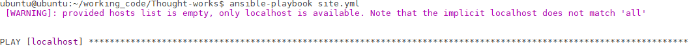
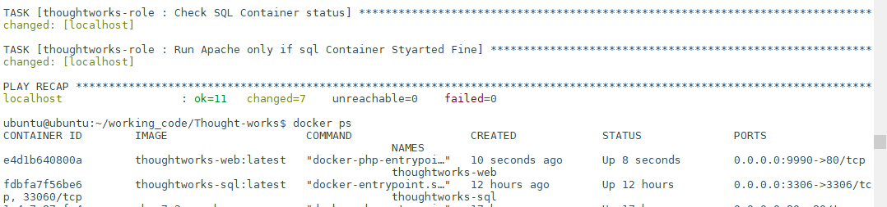
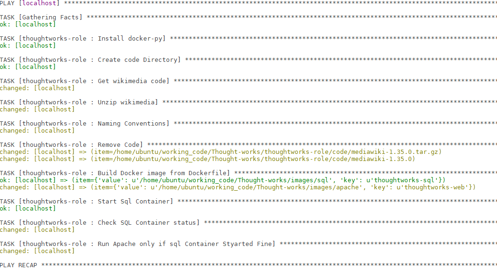
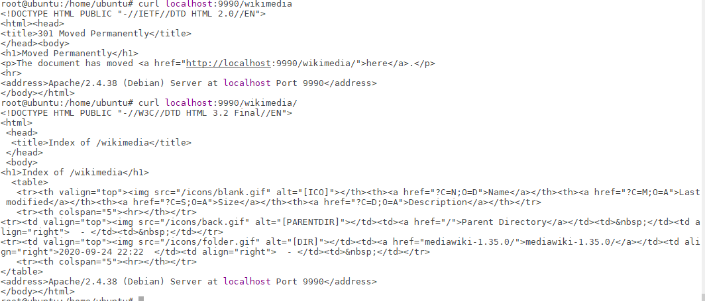
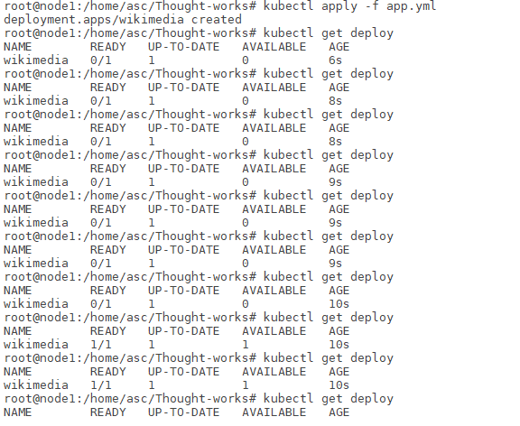

# Thought-works

**A**utomating **W**ikimedia **D**eployments and Migarting Legacy env to Containerized Application

# Prequisites:
    pip
    ansible
    docker
    docker-py


## [thoughtworks-role]
```
Download Wikimedia package and building customised Docker images and creating Containers from the images and at last adding firewall-rules for node.
```

```
├── README.md
├── app.yml
├── images
│   ├── apache
│   │   └── Dockerfile
│   └── sql
│       ├── Dockerfile
│       └── Scripts
│           └── createUser.sql
├── site.yml
└── thoughtworks-role
    ├── README.md
    ├── defaults
    │   └── main.yml
    ├── files
    │   └── test_script.sql
    ├── handlers
    │   └── main.yml
    ├── meta
    │   └── main.yml
    ├── tasks
    │   ├── first.yml
    │   └── main.yml
    ├── templates
    ├── tests
    │   ├── inventory
    │   └── test.yml
    └── vars
        └── main.yml
```
        
   ## How to Run?
   ```
   git clone package
   
   cd Thought-works
   
   ansible-playbook site.yml
   ```
   #**S**teps of Execution:
   ```
   1. First.yml - Will download wikimedia and build docker images. 
   2. Main.yml - Will run the containers setting env values and ports definitions and at last adding firewall-rules
   ```
   
   # Snapshots
   
   
   
   
   
   
   ## Steps to do this deployment compatible with CI/CD 
    
   
   **P**ush these images to repository : https://hub.docker.com/repository/docker/mkhullar1309/sql-wikimedia
   
   # Run two commands
   ```
   kubectl create secret generic sqlpassword --from-literal=MYSQL_ROOT_PASSWORD=******
   kubectl apply -f app.yml
   ```
   
   Enjoy features of Deployment (Rolling-update , creating Services)
   
   
   
   
